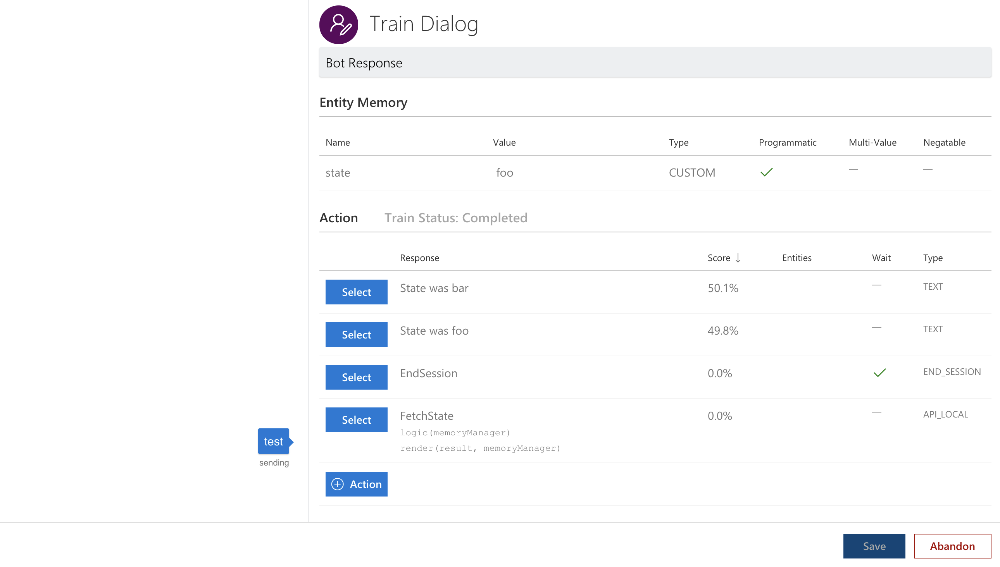

This is a demo repository to reproduce wrong scorings in [Microsoft's new Conversation Learner](https://github.com/Microsoft/ConversationLearner-SDK/).

Install the Conversation Learner's dependencies and start both the UI and the bot (please refer to [package.json](package.json) for further scripts).

```bash
$ yarn install
```

Then copy `.env.example` to `.env` and add your LUIS authoring key. Adding the `CONVERSATION_LEARNER_APP_ID` is only required when deploying the bot, but will remove warnings from the logs (you will get the app id after importing the model below).

Start both the UI and bot using the scripts in [package.json](package.json):

```bash
$ yarn dev
```

Once everything is up and running, import [cl-mwe.cl](cl-mwe.cl) on [http://localhost:5050/](http://localhost:5050) and try adding a new train dialog.

Depending on what value the `FetchState` callback stores into the `state` entity, you will receive similar scores for both text actions, and depending on the `state`'s value, the wrong action will have the higher score (see image below).



As you can see in the image, the state was `foo`, but the Conversation Learner scored the action for `bar`. Furthermore, both scores are ~50%, which wouldn't make much sense if the entities' values would have been taken into account.
